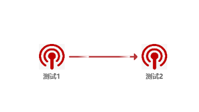

# 流程图绘制库

这个类可以绘制流程图及流动连线的效果。

效果图如下：



## 传参解析

该类传入一个对象，该对象有以下几个字段，其中**imgData**，**canvas**，**flowCanvas**，**ctx**，**flowCtx**必填，其他都可选。

其中注意需要2个**canvas**和**context**实例，主**canvas**为绘制图标、标题、线段的容器，流动效果**canvas**则是流动动画效果的容器。

```typescript
 public imgData //图片列表
 public lineData //线段列表
 public fps //频率
 public stepSize //移动步数
 public flowLength //流动箭头长度
 public canvas //主canvas
 public flowCanvas //流动效果canvas
 public ctx //主canvas context
 public flowCtx //流动效果canvas context
```

其中**imgData**数组的数据格式如下：

```typescript
interface Coordinate {
  x: number //坐标x
  y: number //坐标y
}
interface TextOption {
  text?: string //文案
  show?: boolean //是否显示
  style?: { //样式
    fontWeight?: string //字体浓淡
    position?: string //字体位置
    color?: string //字体颜色
    fontFamily?: string //字体风格
    fontSize?: number //字体东西
    imgTextSplit?: number //图片和文案间隔
  }
}
interface ImgObj extends Coordinate {
  imgUrl: string //图片url
  width: number //图片宽度
  height: number //图片高度
  textOption?: TextOption //文案选项
}
let imgData: Array<ImgObj>;
```

**lineData**数组的数据格式如下，其中只要注意**points**，**arrowDirection**，**lineOption**这几个字段即可：

```typescript
//线段选项
interface LineOption {
  lineWidth?: number //线段宽度
  arrowSize?: number //箭头大小
  arrowRoundSize?: number //箭头圆角大小
  color?: string //颜色
  lineCap?: string //箭头样式
  lineJoin?: string //箭头连接处样式
  lineImgSplit?: number //图片和线段的连接间隔
}
interface SplitLine {
  angle?: number
  length?: number
  originLength?: number
  paths?: Array<PathsItem>
  endLines?: Array<SplitLine>
  startLines?: Array<SplitLine>
  fromPixel?: Coordinate
  toPixel?: Coordinate
}
//线段对象
interface LineObj {
  points: Array<Coordinate> //点坐标数组
  arrowDirection: string //箭头方向
  lineOption?: LineOption //线段选项
  paths?: Array<PathsItem> //路径数组
  lineSpace?: number //线段间隔
  flowOption?: FlowOption //流动效果选项
  originLength?: number //原始长度
  splitLines?: Array<SplitLine> //线段数据
}
let lineData: Array<LineObj> = [{
  points: [{
    x: 260,
    y: 225
  }, {
    x: 390,
    y: 225
  }],
  arrowDirection: 'right'
}];
```

生成的实例有两个方法**draw**和**clear**，**draw**即开始绘制canvas，**clear**则是清除canvas及相关动画。

## 使用

js部分

```typescript
import CreateImgLineFlow from 'flow-chart';
let canvas: HTMLCanvasElement = document.querySelector('#canvas');
let flowCanvas: HTMLCanvasElement = document.querySelector('#flowCanvas');
let { clientHeight, clientWidth } = canvas;
let { clientHeight: flowClientHeight, clientWidth: flowClientWidth } = canvas;
canvas.width = clientWidth;
canvas.height = clientHeight;
flowCanvas.width = flowClientWidth;
flowCanvas.height = flowClientHeight;
let ctx: any = canvas.getContext('2d');
let flowCtx: any = flowCanvas.getContext('2d');
ctx.clearRect(0, 0, 500, 500);
flowCtx.clearRect(0, 0, 500, 500);
let imgData = [{
  imgUrl: 'https://img0.baidu.com/it/u=151392495,873552640&fm=253&fmt=auto&app=138&f=JPEG?w=500&h=500',
  textOption: {
    text: '测试1',
    show: true,
    style: {
      fontWeight: '600',
      position: 'bottom',
    }
  },
  x: 200,
  y: 200,
  width: 50,
  height: 50
}, {
  imgUrl: 'https://img0.baidu.com/it/u=151392495,873552640&fm=253&fmt=auto&app=138&f=JPEG?w=500&h=500',
  textOption: {
    text: '测试1',
    show: true,
    style: {
      fontWeight: '600',
      position: 'bottom',
    }
  },
  x: 400,
  y: 200,
  width: 50,
  height: 50
}]
let lineData = [{
  points: [{
    x: 260,
    y: 225
  }, {
    x: 390,
    y: 225
  }],
  arrowDirection: 'right'
}]
let createImgLineFlow = new CreateImgLineFlow({
  lineData,
  imgData,
  canvas,
  flowCanvas,
  ctx,
  flowCtx
})
createImgLineFlow.draw();
```

html及css部分

```html
<!DOCTYPE html>
<html lang="en">
<head>
    <meta charset="UTF-8">
    <meta http-equiv="X-UA-Compatible" content="IE=edge">
    <meta name="viewport" content="width=device-width, initial-scale=1.0">
    <title>Document</title>
    <style>
        #canvas {
            position: absolute;
            top: 0;
            left: 0;
            width: 100%;
            height: 100%;
        }
        #flowCanvas {
            position: absolute;
            top: 0;
            left: 0;
            width: 100%;
            height: 100%;
        }
    </style>
</head>
<body>
    <canvas id="canvas"></canvas>
    <canvas id="flowCanvas"></canvas>
</body>
</html>
```
